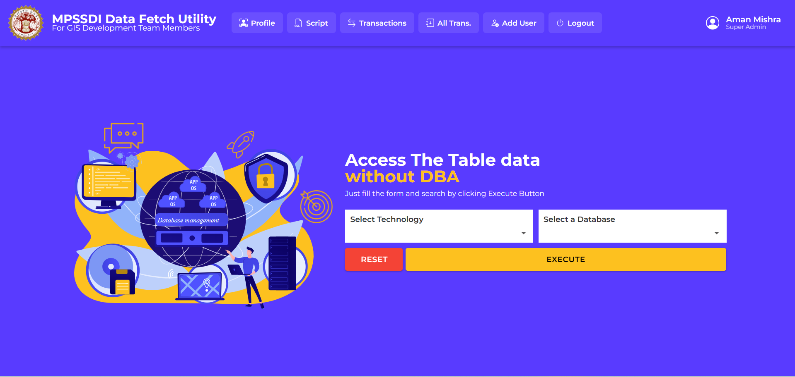
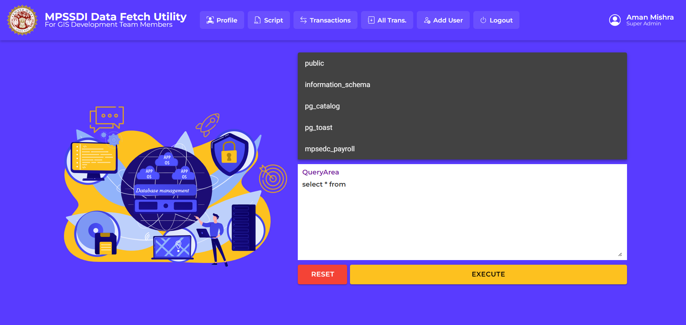
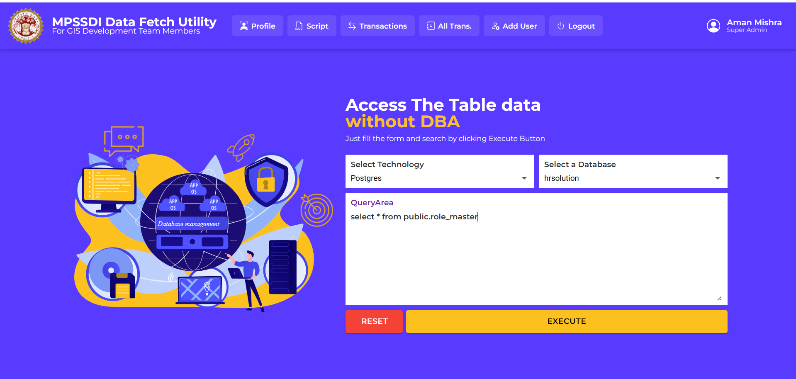
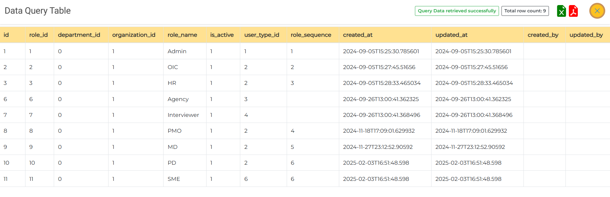

# 🚀 Fetch Data Utility

A secure full-stack data retrieval system built using **.NET Core**, **Angular**, and **PostgreSQL**.

This application allows users to safely fetch and explore database data without direct database access or risk of data modification.

---

## 📌 Project Overview

Fetch Data Utility provides **controlled, read-only access** to database data through APIs.

It eliminates direct DB dependency and allows:
- Executing only **SELECT queries**
- Accessing **functions, views, and stored procedures**
- Working in a **secure and restricted environment**

Developed during internship to solve real-world data access and debugging challenges.

---

## ✨ Features

- 🔐 JWT-based secure API access  
- 📊 Read-only architecture (no INSERT/UPDATE/DELETE)  
- 🧠 Execute custom SELECT queries safely  
- 📁 Access functions, views, stored procedures  
- 🔒 Base64 encrypted request payload  
- 📄 Swagger integration for API testing  

---

## 🖼️ Screenshots

### 🔹 Landing Page


### 🔹 Script Viewer
.png)

### 🔹 Query Executor
  
  


### 🔹 Executed Query Viewer


---

## 🛠️ Tech Stack

**Frontend**
- Angular 12
- TypeScript

**Backend**
- .NET Core Web API
- C#

**Database**
- PostgreSQL

**Tools**
- Swagger
- PgAdmin

---

## 🔐 Security Design

- Only **SELECT queries allowed**
- No direct database modification
- API-level validation
- Encrypted payload (Base64)
- JWT authentication

---

## ⚙️ Setup Instructions

### 1. Clone Repository
```bash
git clone https://github.com/your-username/fetch-data-utility.git
cd fetch-data-utility
````

### 2. Backend Setup

```bash
cd backend
dotnet restore
dotnet run
```

Update connection string in:

```
appsettings.json
```

### 3. Frontend Setup

```bash
cd frontend
npm install
ng serve
```

App runs on:

```
http://localhost:4200
```

---

## 📈 Use Cases

* Secure data access without DB exposure
* Debugging queries safely
* Internal reporting tools
* Controlled data sharing

---

## 👨‍💻 Author

**Aman Mishra**
Full Stack Developer (.NET Core + Angular)

---

## ⭐ If you like this project

Give it a ⭐ and feel free to fork!

````

---

# 🔥 IMPORTANT (screenshots issue fix)

👉 Agar images nahi aa rahi:
- ensure files **same folder me ho README ke**
- exact same name hona chahiye:
  - `Screenshot1-Landing Page.png`
  - etc.

👉 Agar phir bhi issue:
→ folder bana ke daalo: `assets/`

Then change:
```md

````

